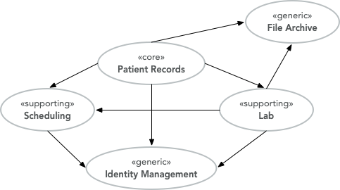

# Strategic Domain-Driven Design
**Domain-Driven Design** (DDD) has been around since Eric Evans publiched his book about the subject in 2003. I myself came into contact with DDD some years ago when I joined a that suffred from data consistency problems. Duplicates showed up in the database, some information was not saved at all, an you could run into optimistic locking errors anywhere and anytime. We managed to solve this by using the building blocks of tactical Domain-Driven Design.
I have learned more about Domain-Driven Design since then and also to try to use my projects wherever appropriate. However, during the past years when i have talked to other developers, many of them have heard about the term Domain-Driven Design, but the do not know what it means. In this article series, I am going to give a brief introduction to Domain-Driven Design as I see and understand it. the content is very much based on the book **Domain-Driven Design: Takling Complexity in the Heart of Software** by Eric Evans and **Implementing Domain-Driven Design** by Vaughn Vernon. However, I have tried to explain everything in my own words and also inject my own thoughts, opinions, and experiences.
You will not become an expert in Domain-Driven Design by reading me article series, but i hope it inspires you to read more about it elsewhere. I also highly encourage you to read the books by Evans and Vernon.

# What is a Domain?
If i look up the word domain in the Dictionary app on my MacBook, I get the following definition:
" [A]n area of terriroty owned or controlled by particular rules or goverment...
    * a specified sphere of activity or knowlaedge...
--- Apple Dictionary
In the case of Domain-Driven Design, it is the second part of the definition that we are interested in. In this case, activity is whatever an organization does and knowledge is how the organization does it. We are also going to add the enviroment in which organization conducts its activities to the domain concept.

# Subdomains
The domain concept is very broad and abstract. To make it more concrete and tangible, it makes sense to split it up into smaller parts called subdomains. Finding these subdomains is not always an easy things to do, and if you get them wrong, you can run into trouble down the road when the pieces in your puzzle all of a sudden do not fil well together.
Before you go looking of subdomains, you should think about the subdomain categories. All subdomains can be devided into three categories:
1. Core domains.
2. Supporting subdomains.
3. Generic subdomains.

Not only will these categories help you to find your subdomains, they will also help you to prioritize your development efforts.

A **core subdomain** is what makes an organization special and different from other organizations. An organization cannot succed (or even exist) without being exceptionally good in their core domain. Because the core doamin is so importent, it should receive the heighest priority, the biggest effort and the best developers. For smaller domains you mey onky identify a single core domain, larger domain may have more than one. YOu should be prepared to implement the features of yhe core domain from scratch.

A **supporting subdomain** is a subdomain that is necessary for the organization to succeed, but it does not fall into the core domain category. It is not generic either because it still requires some level of specialization for the organization in question. You may be able to start with existing solution and tweak it or extend it to your specific needs.

A **generic subdomain** is a subdomian that does not contain anything special to the organization but is still needed for the overall solution to work. You can save a lot of time and work by trying to use off-the-shelf software for your generic subdomains. A typical example would be user identity management.

It is worth noting that the same subdomain can fall into different categories depending on what organization does. For a company that specializes in identity management, identity management is a core domain. However, for a caompany that specializes in customer relations management, identity management is a generic subdomain.

Finally, it is worth pointing out that all subdomains are importent to the overall solution refardless of the category in witch they fall. They do, however, require different amounts of effort and may also have different requirements of quality and completeness.

# EXAMPLE
Let's say we are building an EMR (Electronic Medical Records) system for smaller clinics. We have identified the following subdomains:
1. **Patient Record** for managing patient medical records (personal information, medical history, etc.).
2. **Lab** for ordering lab tests ad managing test results.
3. **Scheduling** for scheduling appoinements.
4. **File Archive** for storing and managing files that  are attached to the patient records (such a different documents, X-ray pictueres, scanned paper documents).
5. **Identity Management** for making sure the right people have access to the right information.

Now, how would we classify thes subdomains? The most obvious ones are **file archivre** and **identity management** which are clearly geniric subdomains. But what about the others? That depends on what is making this particular EMR system stant out amoung the others in the market.
 
